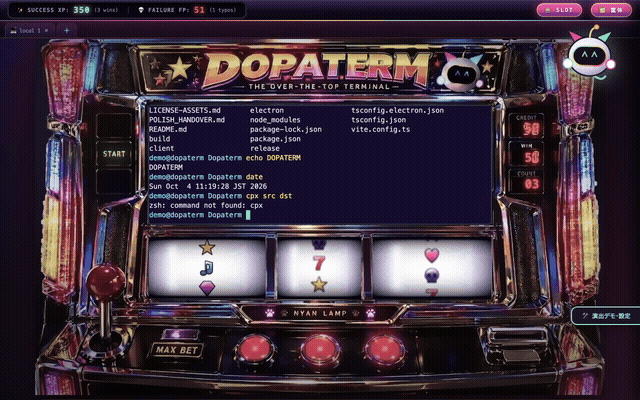

# Dopaterm ✨ The Over-the-Top Terminal

> **普通に使えるターミナルなのに、何でもないコマンドへ異常に豪華な演出を付ける。**  
> *実用部分は堅実、演出部分だけ狂わせる。*



📹 **フル動画（音声あり・約 29 秒）**: [demo/dopaterm-demo.mp4](demo/dopaterm-demo.mp4)

---

## 🎮 概要

Dopaterm は、堅実なターミナルエミュレータ（xterm.js + node-pty）の基盤の上に、80s〜90sアーケードゲームのような過剰でポップなドーパミン演出を重ねた、遊び心を重視したデスクトップターミナル（Electron）です。実用的なターミナルとして普通に使えるのに、何でもないコマンドの成功・失敗へ異常に豪華な演出が付きます。

演出のコンセプトは [Dopa Drill](https://github.com/grmchn/dopa-drill)（MIT）に影響を受けて制作したものですが、コード・キャラクター・素材は一切流用しておらず、公式版・派生版でもありません。

- **実用不可侵**: エフェクトレイヤーは `pointer-events: none` で完全透過。文字選択、スクロール、キー入力、コピー＆ペーストを1ミリ秒も阻害しません。
- **高信頼コマンド検出**: 業界標準の **OSC 133 Shell Integration** を採用し、ユーザー設定を破壊することなく `exit code` を100%正確に取得。
- **オリジナルアート**: 参考実装の素材やキャラクターを一切流用せず、完全オリジナルの電脳猫マスコット「**ターミにゃん**」、Canvas 2D パーティクル、WebGL 背景、Web Audio API 動的シンセサイザーを新規構築。
- **連続実行コンボシステム**: 連続成功回数に応じて、`NORMAL?` → `COMBO!` → `FEVER!!` → `HYPER DOPA` → `10,000回 DOPA SINGULARITY`（WHY ARE YOU STILL COPYING? + エンドロール）へと段階的に演出が進化。
- **失敗・タイプミス演出**: TYPO激突、巨大南京錠（Permission denied）、墓石と幽霊、火山噴火、FAILURE COMBO。
- **DISASTER MODE**: ファイル爆発、ビル倒壊・隕石、画面水没、OOM怪獣、GAME OVER。
- **専用デモモード**: 画面端のスライドパネルから、実コマンドを実行せずに全演出・コンボ・ポーズを即座にプレビュー＆調整可能。

---

## 📥 インストール / ダウンロード

[GitHub Releases](https://github.com/hagix9/dopaterm/releases) から入手できます。

| OS | ファイル |
|---|---|
| macOS (Apple Silicon) | `Dopaterm-<version>-arm64.dmg` / `.zip` |
| Windows (x64) | `Dopaterm.Setup.<version>.exe`（インストーラー）/ `Dopaterm.<version>.exe`（ポータブル） |

配布物は**コード署名・公証なし**のため、macOS Gatekeeper / Windows SmartScreen の警告が出ます。
配布バイナリを実行したくない場合は、下の [Don't trust the binary? Build it yourself.](#-dont-trust-the-binary-build-it-yourself) へ。

---

## 🚀 ソースから起動（Run from source）

```bash
git clone https://github.com/hagix9/dopaterm.git
cd dopaterm
npm ci               # package-lock.json どおりに依存関係を取得
npm run electron     # ビルド + Electron 起動
```

起動すると接続ランチャーが表示され、**ローカルターミナル**または**SSH接続先**を選んで利用できます。
前提条件（Node.js / npm / OS ごとの注意）は [Build it yourself](#-dont-trust-the-binary-build-it-yourself) を参照してください。

### ブラウザモード（デバッグ用）

```bash
npm run build   # dist/client を生成（初回・クライアント変更時。これが無いと UI は配信されません）
npm start       # HTTP + WebSocket + PTY バックエンドのみ起動
```

ターミナルに表示される URL（`http://127.0.0.1:4040/`）をブラウザで開くと、起動ごとに生成されるトークン付き URL へ自動でリダイレクトされます（トークンはログには出力しません）。
ポートを変えるには環境変数 `DOPATERM_PORT` を指定します。

### テスト

```bash
npm run test:unit    # 単体テスト（バックエンド不要）
npm run test:origin  # Origin / Host 検証・Electron ナビゲーション判定・ログ漏洩の回帰テスト（空きポートで自前起動するため事前起動不要）
npm start            # 別ターミナルでバックエンドを起動した状態で:
npm test             # unit + origin + smoke + remote（smoke は 127.0.0.1:4040 のバックエンドが必要）
```

`npm test` は `/bin/zsh`・`/bin/bash` を使うため macOS / Linux 前提です（全件 PASS を確認したのは macOS のみ。Linux・Windows は未検証）。

---

## 🔍 Don't trust the binary? Build it yourself.

配布の exe / dmg を信用する必要はありません。ソースは全部ここにあります。読んで、自分で依存関係を取得して、
自分で起動・ビルドできます。

1. **読む**: 見る場所の目安:
   `electron/main.cjs`・`electron/preload.cjs`（Electron 側と公開 IPC）、`server/`（バックエンド。
   `127.0.0.1` のみ listen、Origin / Host チェック・トークン照合）、`client/index.html`（CSP の `connect-src` は自身とループバック WebSocket のみ）、
   `package.json` と `package-lock.json`（依存関係とビルド設定）。SSH 接続は OS の `ssh` が行います
2. **取得して起動**: [ソースから起動](#-ソースから起動run-from-source) の 3 コマンド（`git clone` → `npm ci` → `npm run electron`）
3. **自分でパッケージを作る**（任意）: [ビルド / パッケージ](#-ビルド--パッケージ) の `npm run dist:win` など

### 前提条件

| 項目 | 内容 |
|---|---|
| Git / Node.js / npm | 検証したのは **Node.js 20.19.4 / npm 10.8.2 のみ**（`npm ci`・テスト・起動・`dist:win`・`dist:mac` すべてこの組み合わせ）。この環境では一部の開発依存（electron-builder 配下の `@electron/rebuild` / `node-abi`）が Node ≥22.12 を宣言しているため、`npm ci` は `EBADENGINE` の警告を出しますが、インストールとビルドは成功します。node-gyp の要求は `^20.17.0 \|\| >=22.9.0` なので Node 20.17 未満は避けてください。Node 22 以降は未検証です |
| ネットワーク | `npm ci` が npm レジストリと Electron のバイナリ配布元から取得します |
| node-pty | ネイティブモジュールです。**macOS / Windows 向けのプリビルド（N-API）が同梱**されており、通常の `npm ci` ではコンパイルされません。N-API は ABI 互換のため **`@electron/rebuild` は不要**で、プリビルドのまま Electron 35 上でロードできることを **macOS arm64 で**確認済みです（Windows は未検証） |
| 追加ツール（通常は不要） | ネイティブコンパイルが走る場面（下記）でのみ Python 3 と C++ ツールチェーンが必要です |

| OS | 状態 |
|---|---|
| **macOS** | `npm ci` + `npm run electron` はコンパイラ不要で動作（arm64 / Node 20.19.4 で検証。Intel 用プリビルドも同梱ですが未検証）。`npm run dist` / `dist:mac` は electron-builder が node-pty を Electron 向けに**再コンパイル**するため Xcode Command Line Tools と Python 3 が必要（Python 3.9.6 で検証） |
| **Windows** | node-pty の win32 プリビルドが同梱されているため、`npm ci` に Visual Studio Build Tools / Python は要らない構成です。`npm ci`・`npm run electron` が動くよう、npm スクリプトは cmd.exe / PowerShell でも動く Node スクリプトにしてあります。**ただし Windows 実機での実行は未検証です**（静的確認のみ） |
| **Linux** | 公式サポート対象外・**未検証**。node-pty のプリビルドが Linux 用には無く、`npm ci` 時に `node-gyp rebuild` へフォールバックする実装のため、Python 3・make・C++ コンパイラが必要になる実装です（実装の読み取りによる記述で、実行は未検証） |

> 「npm さえ入っていれば必ず動く」とは言いません。上の表が検証できた範囲のすべてです。

`npm run electron:rebuild` は node-pty を Electron 向けにソースから再コンパイルする**任意**のコマンドです（通常は不要。
コンパイラが必要。macOS で動作確認済み）。

### 同一ソースから作れる ≠ バイナリが一致する

上記の手順で「公開ソースから自分でビルドした Dopaterm」は手に入りますが、**配布物とバイト単位で一致する
（bit-for-bit reproducible な）ビルドではありません**。ビルド時刻・ツールチェーン・依存関係の解決・パッケージャの
挙動・コード署名などで差が出ます（実際、同じソースから続けて 2 回ビルドした exe でさえファイルサイズが一致しませんでした）。
配布バイナリと自作バイナリが同一であることは保証しません。保証するのは「公開ソースだけから自分でビルドして動かせる」ことです。

---

## 🕹️ 楽しみ方

### 1. 実際のコマンドで遊ぶ

ターミナル上で `cp` コマンドを実行してみてください：
```bash
# 1. テストファイルの作成とコピー
echo "hello dopaterm" > src.txt
cp src.txt dst.txt
```
- コマンド入力中、マスコット「ターミにゃん」が耳を立ててスタンバイ！
- Enter打鍵でファイルが放物線を描いて飛翔！
- コピー完了時、盛大な祝福カードと紙吹雪が舞い散ります！
- 連続して成功させるとコンボ数が増加し、背景が虹色トンネルや宇宙ワープへと進化します。

### 2. 失敗演出を試す
```bash
# タイプミス
cpx invalid

# 存在しないファイル
cp not_found.txt nowhere.txt
```
- 巨大な「TYPO!!」ブロックが落下激突したり、墓石と幽霊が出現します。

### 3. 専用デモモード (Demo Showcase)
画面右上の「**🛠 DEMO SHOWCASE**」ボタンをクリックするとデモパネルが展開します。
- スライダーでコンボ数を1〜10,000以上に自由変更
- ワンクリックで成功・TYPO・DISASTER（爆発、隕石、水没、怪獣）を再生
- ターミにゃんのポーズ確認
- **※デモモードは物理コマンドを一切実行しないため安全です。**

---

## 📂 プロジェクト構造

```text
Dopaterm/
├── server/
│   ├── index.ts              # HTTP/WebSocket サーバー & トークン認証ガード
│   ├── pty-manager.ts        # node-pty セッション管理 & フォールバック
│   ├── shell-integration.ts  # 非破壊的 OSC 133 フックスクリプト生成
│   └── types.ts              # サーバー型定義
├── client/
│   ├── index.html            # メインHTML
│   ├── main.ts               # クライアントメインエントリ
│   ├── style.css             # ネオンポップCSS & アニメーション
│   ├── terminal/
│   │   ├── terminal-manager.ts # xterm.js + FitAddon + OSC 133パース
│   │   └── input-watcher.ts    # キーストローク観測
│   ├── effect/
│   │   ├── effect-director.ts  # 演出オーケストレーション & コンボステートマシン
│   │   ├── mascot.ts           # オリジナルSVG「ターミにゃん」+ Spring物理
│   │   ├── particles.ts        # Canvas 2D パーティクルシステム
│   │   ├── background.ts       # WebGL シェーダー背景 + CSSフォールバック
│   │   ├── audio.ts            # Web Audio API 完全動的シンセサイザー
│   │   └── ui-overlay.ts       # ポップアップカード & エンドロール
│   └── demo/
│       └── demo-rig.ts         # 専用デモモード (Showcase & Debug Panel)
└── docs/                     # Phase 0 設計ドキュメント群
    ├── 01_RESEARCH_REPORT.md
    ├── 02_ARCHITECTURE_AND_DATAFLOW.md
    ├── 03_EVENT_CONTRACT_SPEC.md
    ├── 04_ORIGINAL_ART_AND_DESIGN.md
    └── 05_POC_IMPLEMENTATION_PLAN.md
```

---

## 🛡️ 安全性と不変条件

- **コマンドや出力の無改変**: `exitCode`、`stdout`、`stderr` を一切書き換えません。
- **シェル操作の保証**: 演出エンジンが例外停止しても、PTYおよびシェルプロセスは中断されません。
- **CSWSH保護**: Loopback（`127.0.0.1`）限定バインド、Origin / Host ヘッダー検証（DNS rebinding 対策）、暗号セッショントークン照合を完備。
- **描画負荷保護**: パーティクル上限（800個クランプ）、イベントスロットル、FPS低下時の自動品質調整を実装。

---

## 🖥️ Electron デスクトップ版（Rev.7）

ブラウザ版に加え、Windows / macOS 向けの Electron 製デスクトップアプリとして動作します。
Electron のメインプロセス内で既存バックエンド（HTTP+WS+PTY）を起動するため、**Node.js サーバーの手動起動は不要**です。

起動方法は [ソースから起動](#-ソースから起動run-from-source) を参照してください。

- 起動すると接続ランチャーが表示され、**ローカルターミナル**または**SSH接続先**を選択できます
- 複数セッションはタブで切替（ローカルとSSHを並行利用可能）
- セキュリティ: `contextIsolation`/`sandbox`/`nodeIntegration=false` + CSP。preload 経由で最小限の API（鍵ファイル選択・アプリ情報）のみ公開
- ブラウザ版も利用可能です（同一バックエンドコードを共有。起動方法は上記「ブラウザモード」）

### タブ/セッション操作
- タブバーの **＋** でランチャー再表示 → 新しい接続を追加
- タブの **×** でセッション切断（サーバー側 PTY/ssh プロセスも終了）
- SSH 切断時は「切断」表示 + 再接続ボタン（リモートの実行中プロセスは復元されません）
- **アプリ終了**: 接続先パネルのタイトル行右端に固定配置された「⏻ EXIT」ボタン（ネオンピンク/イエローの大型ボタン・クリック時に短い終了演出）または Cmd+Q（Electron版のみ。ブラウザ版ではボタン非表示。接続先件数やスクロールに影響されず常時押下可能）

## 🔑 SSH 接続（OpenSSH ベース）

OS標準の `ssh` クライアントを PTY 内で実行します（引数は配列構築・シェル文字列連結なし）。

- **対応設定**: 接続名 / ホスト・IP / ポート / ユーザー名 / 認証方式（エージェント・秘密鍵ファイル・パスワード）/ 鍵ファイルパス
- **プロファイル保存先**: `~/.dopaterm/ssh-profiles.json`（秘密鍵の内容・パスフレーズ・パスワードは**一切保存しません**）
- **ホスト鍵確認**: `StrictHostKeyChecking` は無効化していません。初回接続・鍵変更時の `yes/no` 確認は OpenSSH 標準の対話プロンプトが端末内にそのまま表示されます
- **既存環境との連携**: `~/.ssh/config`・ssh-agent・既存の known_hosts はそのまま利用されます
- **OSC 133（エフェクト・自動有効化）**: SSH 接続時にラッパー経由でリモートシェルを起動し、シェル準備完了を検知したら OSC 133 フックを**自動で一時注入**します。接続先の設定ファイル・ファイルは一切変更せず、シェル終了と共に消滅します（zsh/bash 対応）
  - 有効化されるとローカルと同じ演出（開始・成功XP・失敗FP・コンボ・TYPO・余韻）が発火します
  - 注入は内部プロトコルで行い、初期化コマンド・Base64 ペイロードともに画面に表示されません。リモートの `read -s` が全入力を無エコーで取り込み（ペイロードは終端記号 `\x1e` まで一括読み取り）、唯一エコーされる外側1行はクライアント側が送信文字列と完全一致のみ描画から除去します。ペイロードは「受信待機」確認（OSC 5901;W）を受けてからのみ送信し、受信長が一致しない場合は eval せず失敗扱いにするため、初期化に失敗しても通常の SSH 操作を継続できます
  - 非対応シェルやラッパーを拒否する環境ではエフェクト無しのまま、通常の SSH 操作がそのまま使えます
  - タブに FX 状態チップを表示（FX…初期化中 / FX 有効 / FX OFF / FX ! 失敗 / FX ? ネストシェル実行中で未確認）
  - 既存のシェル設定を壊しません（zsh: add-zsh-hook に追加、bash: 既存 PROMPT_COMMAND・DEBUG トラップを保持）
  - 信頼境界: OSC 133 は認証なしの制御シーケンスのため、リモート側が任意出力できれば理論上は偽イベントを送れます。Dopaterm はフック確立確認（OSC 5901;A）を受けたセッションのみイベントを受理します
  - **配色**: xterm パレット（背景・文字・カーソル・ANSI16色）は全タブへ即時反映されます。入力文字色（zsh `zle_highlight`）・プロンプト色（`PS1` への色前置）は既存のフック注入時に接続先シェルのメモリ内へ設定されます（ファイル・永続変更なし）。接続中のテーマ変更は再接続時に反映されます。bash は入力色非対応（readline 制約）。リモートのプロンプトを書き換える系統の設定（starship 等）を使う環境では色が適用されない場合があります
- **セッション終了・再接続**: `exit`/`logout`・Ctrl-D による明示的ログアウト、または exitCode=0 の正常終了でタブを自動的に閉じ、残タブまたは接続ランチャーへ遷移します（引数なし `exit` が直前コマンドの終了ステータスを引き継ぎ非ゼロになる場合も、実行中コマンド名または入力行から明示的ログアウトを検出して自動クローズします）。自動再接続はしません（「SSH再接続」ボタンの明示操作のみ）。正常終了（exitCode=0）と異常切断は色分けして表示します。終了したセッションの演出（バナー・マスコット・グロー）は残留せず、終了後に届いた遅延イベントは破棄されます。ラッパーを拒否する環境への自動プレーンSSHフォールバックは、OSC 5901;R 未到達＝ラッパー未実行が確実な場合に一度だけ行われます

#### 多段 SSH について
多段 SSH 接続自体は通常どおり利用できます（内側でのコマンド操作・内側からのログアウト・外側シェルへの復帰・セッション終了時のタブ管理はすべて動作します）。制限があるのは**内側シェルで実行した個々のコマンドの成功・失敗検出と、XP・FP・演出への連動のみ**です。
- **Dopaterm からの直接接続**・**OpenSSH の ProxyJump（`~/.ssh/config` の `ProxyJump`）**: 最終接続先のシェルに自動でフックが入り、エフェクトが動作します
- **接続先で手入力した `ssh B`**: `ssh` コマンド自体の開始・終了は A 側シェルのイベントとして計上されますが、B 側シェル内のコマンドはフック非注入のため演出は発火しません（B 内での通常操作は可能）。B から `exit` で戻った後も A 側のエフェクトは継続します

## 🎰 DOPA SLOT MODE（スロット筐体）

トップバーの「🎰 SLOT」ボタンで、ターミナルがパチスロ筐体の大型液晶に変わります。

- **写真筐体（既定）**: 実機写真風の筐体画像の上に、ターミナル・3連リール・レバー・停止ボタンの操作領域を配置。開口部は画像座標に正確に追従します
- **クラシック筐体**: CSS + オフライン 3D レンダリング素材（クローム枠・ドームランプ・バックライト図柄）で組んだ従来デザイン。トップバーの「🖼 筐体」ボタンでいつでも切り替え可能（選択は保存されます）
- 左のレバーで 3 リールが回転し、下の 3 つのボタンで停止。揃い方で告知ランプ・筐体の発光・パーティクルが連動します
- ターミナルの可読性・入力・スクロールは筐体表示中も通常どおり動作します

## 💻 対応 OS と検証状況

| OS | 状態 |
|---|---|
| macOS (Apple Silicon / arm64) | ✅ 実機検証済み（ローカル zsh/bash・SSH・演出・筐体） |
| Windows 10/11 (x64) | ⚠️ クロスビルド済み・**実機未検証**。PowerShell のローカルシェル・ConPTY・ssh.exe（Win10+ 標準 OpenSSH）は動作する構成ですが実機確認は未実施です |

- ローカルシェルの演出: macOS の zsh/bash で動作。Windows PowerShell はフック未実装のため演出なしの通常ターミナルになります
- SSH セッションの演出: リモートが zsh/bash の場合に OSC 133 フックを一時注入して動作（接続先のファイルは変更しません）

## 📦 ビルド / パッケージ

[electron-builder](https://www.electron.build/) で配布用パッケージを生成します（出力先: `release/`）。
事前に `npm ci` を済ませてください。

```bash
npm run dist       # 現在の OS 向け
npm run dist:mac   # macOS (.dmg / .zip)
npm run dist:win   # Windows x64 (NSIS インストーラー / portable exe)
```

| コマンド | 検証状況 |
|---|---|
| `npm run dist:mac` | ✅ macOS arm64 で実行・生成物の起動を確認 |
| `npm run dist:win` | ✅ **macOS 上でのクロスビルド**を実行し、x64 の exe 生成と node-pty の win32 バイナリ同梱を確認。⚠️ **Windows 実機上でのビルド・実行は未検証** |

- `dist:win` は node-pty の再ビルドを行わず、同梱の win32 プリビルドを使います（`-c.npmRebuild=false`）。そのためコンパイラは不要です
- `dist` / `dist:mac` は node-pty を再コンパイルします（上記「前提条件」）
- node-pty は `asarUnpack` 済みです
- 生成物は**コード署名・公証なし**です。macOS では `xattr -cr Dopaterm.app` 等での回避が必要になる場合があります
- 生成物にはサードパーティの LICENSE（xterm.js / node-pty / ws など）と、Electron / Chromium のライセンス文書が同梱されます
- Release process: see [RELEASING.md](RELEASING.md)

## ⚠️ プラットフォーム差分（現状）

| 機能 | macOS | Windows | SSHセッション |
|---|---|---|---|
| ローカルシェル | zsh/bash（OSC 133フック付き） | PowerShell | OpenSSH |
| コマンド検出・スコア | ✅ | ❌ 未対応（PowerShellフック未実装） | ✅ リモート zsh/bash（OSC 133 自動注入。非対応シェルでは演出なしの通常SSHとして動作） |
| テーマ即時反映 | zsh: ^X^R / bash: 次回プロンプト | 未対応 | xtermパレット即時・入力/プロンプト色は再接続時 |
| UTF-8・ANSI・リサイズ | ✅ 検証済 | ✅ node-pty ConPTY（実機未検証） | ✅ |

※ Windows 実機での動作検証は未実施。ConPTY・ssh.exe（Win10+標準OpenSSH）は理論上動作する構成です。
SSH 初期化エコーの非表示は、ConPTY が再描画で挿入する制御シーケンス・改行の挟み込みにも
対応するよう耐障害化していますが、実機での表示確認は今後の検証項目です。
※ 多段 SSH 接続は利用可能です。追跡対象外なのは内側シェル内で実行した個々のコマンドの
成功・失敗検出と FX/XP/FP 連動のみで、通常操作・内側ログアウト・外側への復帰は使えます。

## ⚠️ 既知の制限

- **Windows 実機は未検証**: 表示・ConPTY 経路・ssh.exe・音声はクロスビルドと構成確認のみ
- **Windows PowerShell では演出なし**（フック未実装。通常ターミナルとして動作）
- **多段 SSH の内側シェル**: 接続・操作は可能だが、内側の個々のコマンドは FX/XP/FP 追跡対象外
- **bash リモートは入力文字色非対応**（readline に zsh `zle_highlight` 相当がない）
- **starship / powerlevel10k 等**でプロンプトを再構築する環境では色が上書きされる場合あり
- **コード署名・公証なし**: Gatekeeper / SmartScreen の警告が出ます
- 実 IME（ことえり等）での手動入力・実スピーカーでの音声は未検証（合成経路はテスト済み）

## 📄 License

**Dopaterm is released under the [0BSD License](LICENSE).**

You are free to copy, modify, redistribute, fork, reuse, or commercially use the Dopaterm code covered by this license,
including substantial portions of the source code.

Attribution is not required by the 0BSD License.

Feel free to take the code and build something completely different with it.

**日本語での説明**: Dopaterm の作者（hagix9）が著作権を持つ**ソースコード**は 0BSD License です。コピー・改変・再配布・
フォーク・再利用・商用利用が自由で、ソースの大部分をそのまま持っていっても構いません。著作権表示やライセンス表示の
添付も（0BSD では）不要です。気に入った部分を持っていって、全然別のものを作ってください。

ただし、次のものは 0BSD の対象外（または別条件）です。

- **画像・キャラクター「ターミにゃん」・筐体デザイン・アイコン等の素材（それらが映るデモ映像を含む）**: 0BSD の対象外で、著作権は作者に帰属します。
  ビルド・実行のための複製は可、Dopaterm 以外での再利用・再配布は不可です。詳細は [LICENSE-ASSETS.md](LICENSE-ASSETS.md)
  （対象: `client/assets/`・`build/`・`dopa-real/dopa.jpeg`・`demo/` の画像と動画など）。コードだけを持ち出す場合はこれらを含めないでください
- **サードパーティ依存物**: Third-party dependencies and bundled third-party components remain subject to their respective licenses.
  （Electron・Chromium・xterm.js・node-pty・ws など。それぞれのライセンスに従います）
- **過去版**: `430aef7` 以前のコミット（v0.2.0 を含む）は MIT License で公開されていました。その版を入手済みの方は、
  引き続き MIT の条件でも利用できます

法的な条件そのものは [LICENSE](LICENSE) が正で、この節は平易な説明です。

---

## 🙏 謝辞

- **[Dopa Drill](https://github.com/grmchn/dopa-drill)**（MIT）: 「実用ソフトに過剰な演出を乗せる」コンセプトの着想元です。コード・素材は流用しておらず、本プロジェクトは公式版・派生版ではありません
- 筐体デザインは山佐ニューパルサー系の実機構造をデザイン上の参考にしていますが、実機のロゴ・キャラクター・図柄・写真は使用していません
- xterm.js / node-pty / Electron / Vite 等の OSS に感謝します
