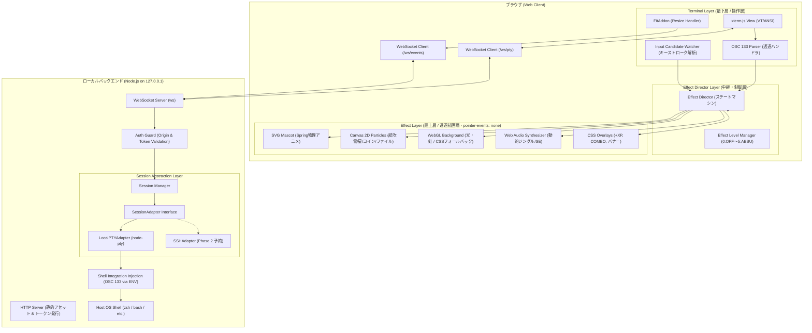

# Dopaterm 最小アーキテクチャとデータフロー (Architecture & Data Flow)

- **プロジェクト名**: Dopaterm
- **フェーズ**: Phase 0（調査・設計）
- **作成日**: 2026-10-03

---

## 1. 全体システムアーキテクチャ

Dopatermは「**堅実なターミナル基盤**」と「**過剰でポップな演出エンジン**」の二層構造で設計されます。二者は完全に疎結合であり、演出のいかなる不具合もターミナルセッションを中断させません。



---

## 2. デュアルWebSocket分離モデル

実用性と信頼性を両立させるため、2つの独立したWebSocketエンドポイントを提供します。

```text
ブラウザクライアント                     ローカルバックエンド
  [xterm.js]    === /ws/pty?token=... ===>   [node-pty I/O Stream]
  (生バイナリ/UTF8)                             (完全透過・最高速)

  [EffectDirector] === /ws/events?token=... => [Session/Resize/Events]
  (JSON メッセージ)                             (制御・状態・心拍)
```

1. **`/ws/pty` (データプレーン)**:
   - xterm.js と OSのPTYを直結するパイプライン。
   - 入力キーコード、ANSI制御コード、標準出力・標準エラー出力を一切の変換・加工なしでストリーミング。
   - JSONパースを行わないため、超高速かつCPU負荷が極小。
2. **`/ws/events` (コントロールプレーン)**:
   - 画面サイズ変更イベント（`resize`: cols/rows）。
   - クライアント・サーバー間の死活監視（`ping/pong`）。
   - 将来の拡張（セッション切替、サーバー側からのイベントプッシュ）。

---

## 3. `cp` コマンド実行のライフサイクルとデータフロー

`cp` コマンドが入力され、完了するまでの一連のデータフローを以下に示します。

```mermaid
sequenceDiagram
    autonumber
    actor User as ユーザー
    participant XTerm as xterm.js
    participant Parser as OSC 133 Parser
    participant InWatcher as Input Watcher
    participant Director as Effect Director
    participant FX as Effect Engine (SVG/Canvas/Audio)
    participant WSPty as WS (/ws/pty)
    participant PTY as node-pty (Host Shell)

    User->>XTerm: キー入力: "cp -R src backup"
    XTerm->>WSPty: リアルタイムに文字送信
    WSPty->>PTY: 文字送信 (シェルへ)
    XTerm->>InWatcher: キーストローク観測
    Note over InWatcher: "cp " を検出 (Candidate)
    InWatcher->>Director: emit: command_candidate { cmd: "cp", ... }
    Director->>FX: マスコット準備 (耳ピクピク, カード枠浮き出し)

    User->>XTerm: Enter打鍵 (\r)
    XTerm->>WSPty: "\r" 送信
    WSPty->>PTY: "\r" 送信 (シェル実行開始)
    
    PTY-->>WSPty: OSC 133;C (Command Started: cp)
    WSPty-->>XTerm: OSCシーケンス含むPTYストリーム
    XTerm->>Parser: registerOscHandler(133) が捕捉・画面非表示
    Parser->>Director: emit: command_started { cmd: "cp", timestamp }
    
    Director->>FX: ★ 演出開始 (Levelに応じた演出)
    Note over FX: ・マスコット: ファイル小包抱えて飛行<br/>・Canvas: 画面左右にファイルが飛翔<br/>・Audio: 軽快なコピー効果音 (Loop/Chime)<br/>・UI: "FILE TRANSFER CHALLENGE" バナー表示

    Note over PTY: OSによる実際のファイルコピー処理実行
    
    alt コピー成功 (exit code: 0)
        PTY-->>WSPty: OSC 133;D;0 (Command Finished: code=0)
        WSPty-->>XTerm: OSCシーケンス含むPTYストリーム
        XTerm->>Parser: 捕捉・消費
        Parser->>Director: emit: command_finished { cmd: "cp", exitCode: 0 }
        Director->>FX: ★ 成功演出発火 (PERFECT COPY)
        Note over FX: ・Canvas: 大量の紙吹雪・星パーティクル噴出<br/>・UI: "✨ PERFECT COPY ✨ +500 XP" ポップアップ<br/>・Audio: 勝利のファンファーレ (Arpeggio Synth)<br/>・マスコット: ドヤ顔ガッツポーズ
        Note over Director: 0.8秒タイマー開始
        Director->>FX: 演出フェードアウト退場
        Note over FX: ターミナル画面は完全にクリア、通常シェル表示へ
    else コピー失敗 (exit code != 0, 例: No such file)
        PTY-->>WSPty: OSC 133;D;1 (Command Finished: code=1)
        WSPty-->>XTerm: OSCシーケンス含むPTYストリーム
        XTerm->>Parser: 捕捉・消費
        Parser->>Director: emit: command_finished { cmd: "cp", exitCode: 1 }
        Director->>FX: ★ 演出中断・退場
        Note over FX: ・成功演出 (PERFECT/紙吹雪) は絶対に出さない<br/>・マスコット: 軽く首を振って通常位置へ復帰<br/>・即座に演出オーバーレイ消去
    end
```

---

## 4. 将来拡張を見据えた `SessionAdapter` 設計

Rev.3設計書に掲げられている「**ローカルPoCを先に作り、SSHは将来のSessionAdapterとして考慮する**」を実現するためのバックエンドインターフェース定義です。

```typescript
export interface TerminalDimensions {
  cols: number;
  rows: number;
}

export interface SessionAdapter {
  readonly id: string;
  readonly type: 'local' | 'ssh';

  /** セッションの初期化とシェルの起動 */
  spawn(dimensions: TerminalDimensions): Promise<void>;

  /** PTYへの入力データ書き込み */
  write(data: string | Buffer): void;

  /** PTYのウィンドウサイズ変更 */
  resize(dimensions: TerminalDimensions): void;

  /** セッションの切断・クリーンアップ */
  dispose(): Promise<void>;

  /** イベントリスナー登録 */
  onData(handler: (data: string) => void): void;
  onExit(handler: (exitCode: number, signal?: number) => void): void;
}
```

- **Phase 1 (PoC)**: `LocalPTYAdapter` を実装し、`node-pty` をラップ。
- **Phase 2 (SSH)**: `SSHGatewayAdapter` を追加。フロントエンドやEffect Directorは一切のコード変更なしで、ローカルとSSHセッションを等価に扱えます。

---

## 5. レイヤー構成とDOMツリーの責務分離

ブラウザ内のDOM配置を以下のように固定し、ターミナル操作の不可侵性を保証します。

```html
<div id="dopaterm-root" class="dopaterm-container">
  <!-- レイヤー1: 背景演出 (最背面) -->
  <canvas id="bg-canvas" class="layer bg-layer"></canvas>
  <div id="bg-fallback" class="layer bg-css-fallback"></div>

  <!-- レイヤー2: ターミナル実体 (中間層・全ポインターイベントを独占) -->
  <div id="terminal-container" class="layer terminal-layer">
    <!-- xterm.js がここにCanvas/DOMを生成 -->
  </div>

  <!-- レイヤー3: エフェクト・オーバーレイ (最前面・pointer-events: none) -->
  <div id="effect-overlay" class="layer effect-layer" style="pointer-events: none;">
    <!-- パーティクル描画用 Canvas -->
    <canvas id="fx-canvas"></canvas>
    
    <!-- SVG マスコット -->
    <div id="mascot-container" class="mascot-box">
      <svg id="mascot-svg" ...></svg>
    </div>

    <!-- UI演出カード (+XP, COMBO, PERFECTバナー) -->
    <div id="ui-card-container" class="ui-card-anchor"></div>
  </div>
</div>
```

### スタイル規約の重要事項
- `.effect-layer` は常に `position: absolute; inset: 0; pointer-events: none; z-index: 100;` を保持します。
- クリック、マウスドラッグ、ホイールスクロール、テキスト選択、右クリックメニュー等のすべてのユーザー入力は、透過して下の `.terminal-layer`（xterm.js）にダイレクトに到達します。
- これにより、演出がどれほど荒れ狂っていても、ユーザーはターミナルの文字選択やコマンド入力を1ミリ秒も妨げられません。

### 追記 (Rev.3.3): 固定トップバーと SLOT モード

実装では上記構造に以下が追加されています。

```html
<header id="top-bar">
  <div id="score-hud-container">  <!-- XP/FP スコア HUD: xterm領域の外・常時表示 -->
  <div id="top-bar-right">        <!-- 🎰 SLOT トグル 等 -->
</header>
<div id="terminal-container">     <!-- top: var(--topbar-h) から開始（HUDと重ならない） -->
<div id="effect-overlay">         <!-- pointer-events: none -->
<div id="slot-container">         <!-- SLOT モード時のみ display:flex（実機筐体型 Rev.2） -->
  <div class="slot-cabinet">      <!-- 縦長前扉構造 -->
    <div class="cab-marquee">     <!-- 上部: 電飾ランプ2列 + DOPA SLOTロゴ -->
    <div class="cab-window-row">  <!-- 中央: サイドランプ | リール窓 | サイドランプ -->
      <div class="reel-window-frame"><div class="reel-window-bezel">
        <div id="slot-screen">    <!-- SLOT時: #terminal-container がここへ DOM 移動 -->
    <div class="cab-info">        <!-- 7seg風 XP/FP/COMBO/LV + REEL図柄セル×3 -->
    <div class="cab-panel">       <!-- 下部: 発光停止ボタン×3 + 右側スタートレバー -->
    <div class="cab-footer">      <!-- 底部: スピーカーグリル装飾 -->
```

- **スコアHUDの分離**: 成功/失敗スコアは `#top-bar`（`--topbar-h`）内の `#score-hud-container` に置かれ、xterm.js の表示領域 `top: var(--topbar-h)` と重なりません。`FitAddon` はトップバー分を差し引いた領域でフィットします。
- **SLOT モードの xterm 再利用**: `#app.slot-mode` 時、`#terminal-container` をそのまま `.slot-screen` 内へ `appendChild` で移動します。xterm.js インスタンス・PTY WebSocket・スクロールバックは保持され、解除時は元の親・位置へ `insertBefore` で復帰します。移動後は `terminal.fit()` を再呼出しします。

### 追記 (Rev.5): 演出タイムラインと熱量レイヤー

`#effect-overlay` 内に `#edge-glow`（縁グロー）を追加し、演出を「予兆→メイン→追撃→余韻」の4フェーズに拡張しました。

- **予兆**: `command_started` で熱量微増（縁グロー点灯・マスコット構え）
- **メイン**: `command_finished` で既存のランダムバリアント演出
- **追撃**: メイン直後に遅延ミニバーストを1〜4発スケジュール（同時上限4）
- **余韻**: `ember` パーティクル（漂う残光・上限40個）と熱量駆動の縁グローが段階的に減衰
- **熱量 (heat 0-1)**: 実行開始で +0.07、成功で +0.18〜（ランク・LUCKY で増幅）、失敗で +0.14。200ms 周期で減衰し、`--dopa-heat` CSS変数・マスコット興奮（>0.45）・SLOT筐体発光（`cab-heated` >0.35 / `cab-blazing` >0.7）に連動。`clearAll` で完全リセット
- 連続実行時は熱量が加算され前の余韻を消去しないため、演出が自然につながる。演出レベル0では熱量も発火しない
- **SLOT 操作の分離**: レバー/停止ボタンは `SlotMachine` 内の演出のみを発火し、`/ws/pty` への write 経路を持ちません。実コマンド成否は `EffectDirector.onRealResult` の一方向コールバックでのみ筐体発光に反映されます。
