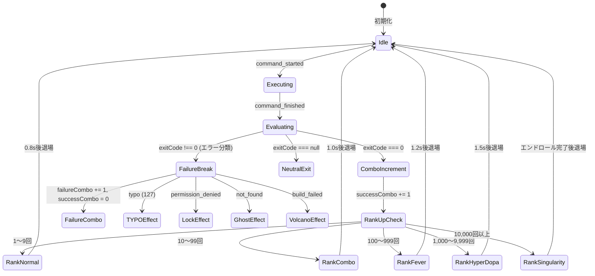

# Dopaterm イベント契約仕様書 (Event Contract Specification)

- **プロジェクト名**: Dopaterm
- **フェーズ**: Phase 0（調査・設計） / 追加仕様反映版
- **作成日**: 2026-10-03
- **状態**: 草案 (Draft Rev.3.1)

---

## 1. 目的と基本原則

本仕様は、ターミナル観測層（Input Watcher / Shell Integration / OSC Parser）と演出エンジン（Effect Director）の間で交わされるイベントプロトコルを定義します。

### 基本原則 (Invariants)
1. **推測と確定の分離**: 入力から推測した候補（Candidate）と、シェルで実行が確定したコマンド（Started）を型レベルで明確に区別する。
2. **成否の厳格性と分類**:
   - `exitCode === 0` が確認されない限り、演出エンジンは `PERFECT` や祝福の紙吹雪を表示してはならない。
   - `exitCode !== 0` の場合は、終了コードと直前の出力抜粋（`outputTail`）に基づきエラー種別を分類して専用の失敗演出を発火する。分類を確定できない場合は `generic_error`（不明）として扱う。
   - 対応する `command_started` (OSC 133;C) を持たない `command_finished` (OSC 133;D) は、実行イベントとして成立しないため破棄し、実績に計上しない（シェル初回プロンプトや空 Enter で D のみ発行されうるため）。
   - `executionId` は `command_started` で採番し、対応する `command_finished` で同一値を引き継ぐ。
3. **実測値の偽装禁止**: 実測の転送バイト数・ファイル数が取得できない場合、架空の数値（例: `12.81 GB`）を実測値として画面に表示してはならない（装飾的COMBO数値のみ許容）。
4. **べき等性と順序保証**: 各コマンド実行には一意な `executionId` を付与し、重複処理や遅延到着イベントによる状態不整合を防ぐ。
5. **描画負荷の隔離**: コンボ数値（論理カウント）と描画オブジェクト数（物理パーティクル数）を分離し、高頻度イベントは集約・スロットルする。

---

## 2. イベントスキーマ一覧

```text
[Input Key Stream]  ───> command_candidate (推測・未確定)
                              │
[OSC 133;C / Start] ───> command_started (実行確定)
                              │
[OSC 133;D / Exit]  ───> command_finished (終了確定・exitCode・エラー分類)
                              │
                        combo_updated (コンボ更新・ランク判定)
                              │
[OS Signal / TCP]   ───> session_disconnected (接続切断)

[Demo Rig Panel]    ───> demo_simulate_event (実コマンドを伴わない演出注入)
```

---

## 3. TypeScript型定義 (Event Protocol Definition)

```typescript
/**
 * セッションおよびコマンドの一意識別子
 */
export type SessionId = string;
export type ExecutionId = string;

/**
 * コマンド種別の定義
 */
export type CommandType = 'cp' | 'mkdir' | 'rm' | 'git' | 'cargo' | 'unknown';

/**
 * エラー演出の分類
 */
export type FailureCategory =
  | 'typo'              // 127 / command not found
  | 'permission_denied' // 126 / permission denied
  | 'not_found'         // no such file or directory
  | 'build_failed'      // compilation/build error
  | 'generic_error';    // その他異常終了

/**
 * コンボ進化ランク
 */
export type ComboRank =
  | 'normal'        // 1〜9回
  | 'combo'         // 10〜99回
  | 'fever'         // 100〜999回
  | 'hyper_dopa'    // 1,000〜9,999回
  | 'singularity';  // 10,000回以上

/**
 * DISASTER演出種別
 */
export type DisasterType =
  | 'file_explosion'    // rm でファイル爆発
  | 'meteor_collapse'   // 大量削除でビル倒壊・隕石
  | 'waterlogging'      // ディスク容量不足で水没
  | 'oom_monster'       // OOMで怪獣がプロセス捕食
  | 'game_over';        // サービス/コンテナ停止

/**
 * 基本イベントメタデータ
 */
export interface BaseEvent {
  /** イベント発行のUNIXタイムスタンプ (ms) */
  timestamp: number;
  /** セッションID */
  sessionId: SessionId;
}

/**
 * 1. command_candidate: 入力観測から推測されたコマンド (未確定)
 */
export interface CommandCandidateEvent extends BaseEvent {
  type: 'command_candidate';
  command: CommandType;
  rawInput: string;
  args: string[];
}

/**
 * 2. command_started: シェルでの実行開始を確認できたコマンド
 */
export interface CommandStartedEvent extends BaseEvent {
  type: 'command_started';
  executionId: ExecutionId;
  command: CommandType;
  commandLine: string;
  /** これまでの総実行回数 (Attempts) */
  attemptNumber: number;
}

/**
 * 3. command_finished: シェルでの実行終了と終了ステータス
 */
export interface CommandFinishedEvent extends BaseEvent {
  type: 'command_finished';
  executionId: ExecutionId;
  command: CommandType;
  /**
   * 終了ステータスコード
   * - 0: 正常終了 -> 祝福演出
   * - 1以上: 異常終了 -> 失敗演出
   * - null: 取得不可 -> 成功/失敗断定せず退場
   */
  exitCode: number | null;
  /** 分類されたエラー種別 (exitCode !== 0 の場合) */
  failureCategory?: FailureCategory;
  /**
   * 直前のPTY出力末尾の抜粋 (ANSI除去済み)
   * 注意: PTY は stdout/stderr を単一ストリームに混在させるため、
   * 厳密な stderr ではなく「直近の出力末尾」として扱う。
   */
  outputTail?: string;
  /** 所要時間 (ms)。OSC 133;C 受信時刻から 133;D 受信時刻までの実測値 */
  durationMs: number;
}

/**
 * 4. combo_updated: コンボ状態の更新通知
 */
export interface ComboUpdatedEvent extends BaseEvent {
  type: 'combo_updated';
  command: CommandType;
  /** 連続正常終了数 (Success Combo) */
  successCombo: number;
  /** 連続失敗数 (Failure Combo) */
  failureCombo: number;
  /** 総実行回数 */
  totalAttempts: number;
  /** 現在のコンボランク */
  rank: ComboRank;
  /** 演出倍率 */
  multiplier: number;
}

/**
 * 5. disaster_triggered: DISASTER MODE 演出発火
 */
export interface DisasterTriggeredEvent extends BaseEvent {
  type: 'disaster_triggered';
  disasterType: DisasterType;
  details: string;
}

/**
 * 6. demo_simulate_event: 専用デモモードからのモック演出注入
 * - 制約: バックエンドのシェル・PTYへは一切コマンドを送信しない
 */
export interface DemoSimulateEvent extends BaseEvent {
  type: 'demo_simulate';
  targetCombo: number;
  targetRank: ComboRank;
  simulateAction: 'success' | 'failure' | 'disaster' | 'mascot_pose';
  failureCategory?: FailureCategory;
  disasterType?: DisasterType;
  mascotPose?: string;
}

/**
 * 7. session_disconnected: 接続断
 */
export interface SessionDisconnectedEvent extends BaseEvent {
  type: 'session_disconnected';
  reason: string;
}

export type DopatermEvent =
  | CommandCandidateEvent
  | CommandStartedEvent
  | CommandFinishedEvent
  | ComboUpdatedEvent
  | DisasterTriggeredEvent
  | DemoSimulateEvent
  | SessionDisconnectedEvent;
```

---

## 4. コンボマネージャーのステートマシンと演出規約



---

## 5. 高頻度イベント集約と安全制約 (Throttling Contract)

1. **イベント間引き（Event Coalescing）**:
   - `command_started` / `command_finished` が 100ms 以内に連続して到着した場合、Effect Director は描画アニメーションの重複生成をスキップし、内部カウンター（`successCombo`）のみを加算更新する。
2. **描画オブジェクト数のクランプ**:
   - `successCombo` が 10,000 であっても、Canvasパーティクル数は最大 800個 にクランプ。
   - レベルに応じた演出の派手さは「パーティクル自体の速度・色彩・シェーダー」で表現し、オブジェクト生成数で表現しない。
